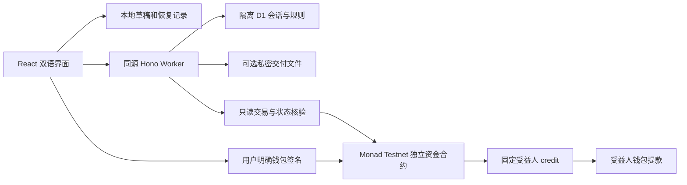

# 技术架构

六工具共用浏览器、同源Worker、账号和工作台。当前工程实现与发布验收分别记录在[总计划](../planning/DEVELOPMENT_PLAN.md)。

## 数据与资金路径

一个monadbox Worker；main正式发布，dev使用Worker Previews。云端、发布、业务付款、附件均默认关闭，主网禁止。构建/CI不会创建远程资源、应用远程迁移或广播公开交易。

## 模块与版本

| 层 | 主要位置与职责 |
| --- | --- |
| 页面 | `src/app/group`、`cloud`、`modules`；六工具创建、规则预览、发布、资金、双签、签到、附件 |
| 共用体验 | `src/app/WorkspacePage.tsx`、`shared`；本人创建/参与/待办/credit/历史，明确同源恢复链接 |
| 规则与核验 | `src/shared/group`、`cloud`、`modules`；整数金额、严格schema、哈希、固定部署/runtime、EOA、nonce、事件及最终性 |
| API | `src/worker/cloud`、`modules`；SIWE、会话、CSRF、owner/revision、幂等冻结与只读确认 |
| 数据 | `0001`基础、`0002`cloud schema2、`0003`module schema1、`0004`附件schema1；环境marker校验 |
| 合约 | GroupV1与V2、Split、Deliver、Attend、Milestones、Rewards独立不可升级合约；共用PullCredit及必要的AgreementCredit |
| 测试 | 单元伪RPC边界、真实隔离D1/R2、Foundry、固定loopback Anvil、HTTP与桌面/手机Chromium |

GroupV1保留原编译入口及旧版读写/退出。其他模块由固定Solidity0.8.28/Paris/optimizer200生成ABI和runtime，按chain+address+version读取原发布；新增版本不会把旧订单挂到新地址。运行时代码掩码核验后另读不可变资产、管理员及签名域。

## 发布和恢复

通常先冻结规则再明确签名发布空实例，付款另外授权/入金。**Rewards例外**：冻结准确授权意图，授权确认后另准备原子全额入金创建；两步各明确签名，保留原授权证明并重新读取真实nonce。

交易核对账号、nonce、链、类型、目标、完整参数/调用hash、准确事件、canonical和finalized覆盖，并读回原实例。历史nonce用有界二分定位，不依赖仅扫描最近若干块。unknown不能抹除已保存的证据、解冻或自动重发。浏览器发送前写入日志，并用Web Locks阻止同账号未决交易并发。

SIWE原始签名不保存；双签和签到签名仅在页面内存中交换，显式提交后进入公开链。恢复记录只保留公开消息、调用hash与交易证据；需要时临时读取链上witness复核。

## 权限、文件与故障

D1不是资金权威。owner来自已认证会话，修改需revision，发布后固定metadata字节与termsHash。JSON按实际字节限20KB。附件按实际流限10MiB，只支持TXT/PNG/JPEG；固定双方每次读写均重新核验链上实例和R2环境marker。每阶段5件，阶段推进禁止旧预留上传，历史文件仍对双方可读。

订单结算90天后API停止文件访问。自动物理清理未启用；真实附件上线前需确认资源隔离、保留/删除政策和私密支持渠道。未实现病毒扫描，不宣称端到端加密。

RPC故障、状态变化、错链或部署不匹配时不展示核验成功。暂停新增入金保留原合约退出；管理员不能裁决争议、改变受益人或任意提款。

## 运行和证据

公开首屏按路由拆分，钱包与资金工具按需加载。构建生成初始JS gzip预算、合约尺寸、源码/ABI/锁文件哈希及直接依赖许可清单。CI只读构建与测试，保留源代码快照、屏幕录像、截图、Gas及性能证据；录像显示LOCAL，注入钱包和MockToken不冒称真实设备验收。

尚未启用或不在本次范围：自动全链索引、通知队列、钱包代付/邮箱钱包、智能账号/EIP-1271写入、法币、跨链和主网。实际设备、真实部署、安全审阅与试用仍按外部验收执行。
